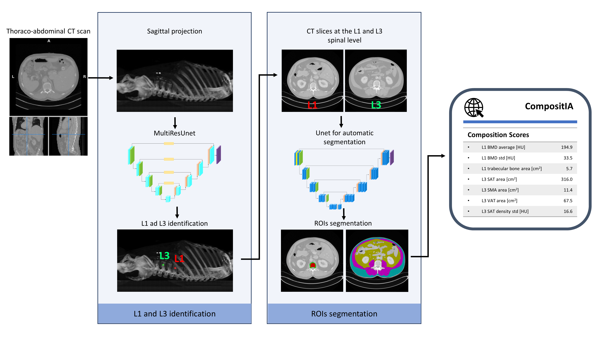

# CompositIA

CompositIA is a fully automated system designed to calculate body composition from thoraco-abdominal CT scans.



**CompositIA** consists of three blocks:

* **`MultiResUNet`** to predict CT slices intersecting the L1 and L3 vertebrae.
* **`UNet`** to segment the L1 vertebra from the CT slice at the L1 spinal level. The L1 segmentation is composed of two different regions: spungiosa tissue (spun) and cortical tissue (cort).
* **`UNet`** to segment the CT slice at the L3 spinal level in the following regions: visceral adipose tissue (VAT), subcutaneous adipose tissue (SAT), skeletal muscle area (SMA).

**`MultiResUNet`** is based on the implementation proposed by Ibtehaz, and Sohel Rahman described in this [paper](https://www.sciencedirect.com/science/article/abs/pii/S0893608019302503?via%3Dihub). **`UNet`** is based on the implementation proposed by Ronneberger et al. detailed in the [work](https://arxiv.org/pdf/1505.04597.pdf). 
All the models are developed using **Tensorflow 2**. 

[//]:<L3 U-net weights are available at this [link](https://drive.google.com/file/d/1wUEumfrXRGFBlY6pT9z1NB1Eg9_Ni2UT/view?usp=share_link).>

[//]:<Please cite the following [paper](https://arxiv.org/) when using CompositIA:>
    
## Installation instructions

First, create a virtual environment with Anaconda:
```
conda create --name comp --file requirements.txt
conda activate comp
```
Clone the CompositIA repository:
```
git clone https://github.com/rcabini/compositIA.git
```

## Train CompositIA

### Data preparation
CompositIA supports data in the form of 3D NIfTI images (files ending in `.nii.gz`). For DICOM to NIfTI conversion, we recommend using ITK-Snap. Organize the NIfTI files of both images and segmentations as follows: 

    Dataset/Images/
    ├── 001
    |   ├── data.nii.gz
    ├── 002
    |   ├── data.nii.gz
    ├── 003
    |   ├── data.nii.gz
    ├── ...
    
    Dataset/Segmentations/
    ├── 001
    |   ├── segmentation.nii.gz
    ├── 002
    |   ├── segmentation.nii.gz
    ├── 003
    |   ├── segmentation.nii.gz
    ├── ...

CompositIA was trained and tested by using a k-fold cross-validation strategy. To create the train-test splits, run:

    cd utils
    python k-fold_generator.py --data_folder path_to_Dataset/ --output_folder path_to_Dataset/ --k 5

Replace `path_to_Dataset` with the actual path to the Dataset folder. The default number of folds (`k`) is 5.

To create dataset necessary to train the CompositIA tool you sholud create three different dataset for the three steps:

* To create dataset to train the L1/L3 localization model please run:
```
  cd slicer/
  python data_generator.py --data_folder path_to_Dataset/ --output_folder path_to_Dataset/slicer/
```
* To create dataset to train the L1 segmentation model:
```
  cd L1scripts/
  python data_generator.py --data_folder path_to_Dataset/ --output_folder path_to_Dataset/L1/
```
* To create dataset to train the L3 segmentation model:
```
  cd L3scripts/
  python data_generator.py --data_folder path_to_Dataset/ --output_folder path_to_Dataset/L3/
```
where `path_to_Dataset` should be replaced with the path to the Dataset folder.

### Training on k-folds
To to train the CompositIA tool you sholud train the three different models:

* L1/L3 localization model training, run:
```
  cd slicer/
  python main_slicer_CV.py --data_folder path_to_Dataset/slicer/ --weights_folder ./weights_slicer/
```
* L1 segmentation training, run:
```
  cd L1scripts/
  python main_L1_CV.py --data_folder path_to_Dataset/L1/ --weights_folder ./weights_L1/
```
* L3 segmentation training, run:
```
  cd L3scripts/
  python main_L3_CV.py --data_folder path_to_Dataset/L3/ --weights_folder ./weights_L3/
```

### Testing on k-folds
To to test the CompositIA tool on the k-folds you sholud test the three different models:

* L1/L3 localization model testing, run:
```
  cd slicer/
  python run_slicer_CV.py --data_folder path_to_Dataset/slicer/
                          --weights_folder ./weights_slicer/
                          --output_folder ./results_slicer/
```
* L1 segmentation testing, run:
```
  cd L1scripts/
  python run_L1_CV.py --data_folder path_to_Dataset/L1/
                      --weights_folder ./weights_L1/ 
                      --output_folder ./results_L1/
```
* L3 segmentation testing, run:
```
  cd L3scripts/
  python run_L3_CV.py --data_folder path_to_Dataset/L3/
                      --weights_folder ./weights_L3/
                      --output_folder ./results_L3/
```

## Run CompositIA on a new dataset

To run the complete CompositIA tool on a new thoraco-abdominal CT scan, you should run:

    python CompositIA.py --input_image path_to_input/data.nii.gz --output_path path_to_output/

where `path_to_input` is the path to the input NIfTI CT and `path_to_output` is the path to the output directory where all the results will be saved. The output directory includes: 

* `scores.json`: contains the body composition indices computed by CompositIA.;
* `planes.png`: highlights the predicted position of L1 and L3 planes;
* `L1slice.png` and `L3slice.png`: extracted slices of the CT scan;
* `L1segmentation.png` and `L3segmentation.png`: segmentations predicted by CompositIA. 

To run the complete CompositIA tool by using custom weights, please run:

    python CompositIA.py --input_image path_to_input/data.nii.gz 
                         --output_path path_to_output/
                         --weighs_slicer path_to_weights_slicer/weights.hdf5
                         --weights_L1 path_to_weights_L1/weights.hdf5
                         --weights_L3 path_to_weights_L3/weights.hdf5

Replace the paths with the appropriate paths to your custom weight files.